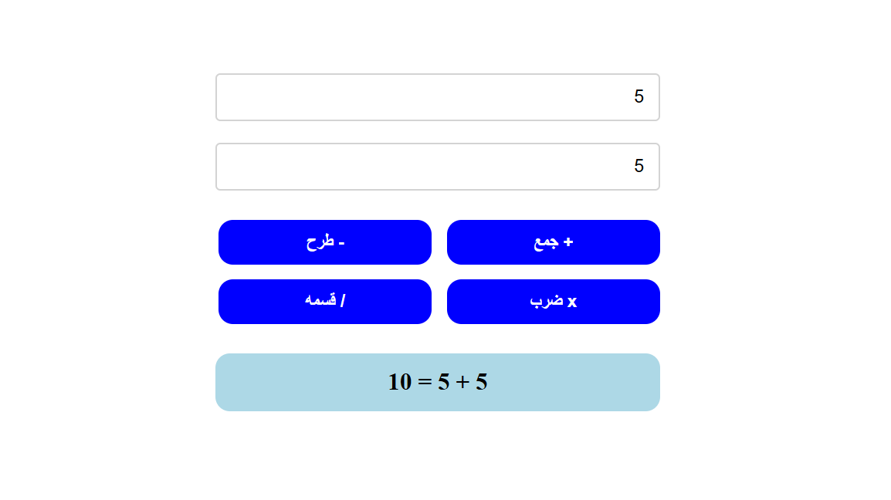

# Interactive Calculator App

A responsive Arabic (RTL) calculator web application that receives two numeric inputs, performs basic arithmetic operations, and dynamically displays the formatted result.

## Educational Objective
تعلم كيفية بناء آلة حاسبة تفاعلية باستخدام JavaScript، مع تطبيق مبادئ التحقق من المدخلات وعرض النتائج بشكل تفاعلي.

## Course Progression
- **Module:** Week 2 — Operators and String Methods
- **Lessons Covered:** #018 to #030 (Arithmetic Operators, Type Coercion, Math Object, Number & String Methods)

## Task Specifications
Develop a calculator app with a form where the user inputs two numbers. Include Add, Subtract, Multiply, and Divide buttons. Display the result dynamically on the page. Use numeric methods to handle calculations. If the user enters invalid data, display a validation message.

## Application Preview

## Technical Implementation
1. **Event Handling:** Iterates through operation buttons to attach click listeners and prevent default form submittal.
2. **Validation & Type Conversion:** Verifies input fields are non-empty and converts input strings into numeric values using `Number()`.
3. **Switch Evaluation & Display:** Evaluates the selected operation (`+`, `-`, `*`, `/`) using a `switch` statement, constructs the equation string using template literals, and displays the result container.

## Technologies Used
- HTML5 (Number inputs & button controls)
- CSS3 (Flexbox & Transitions)
- JavaScript (ES6+ Control Flow & Type Coercion)
