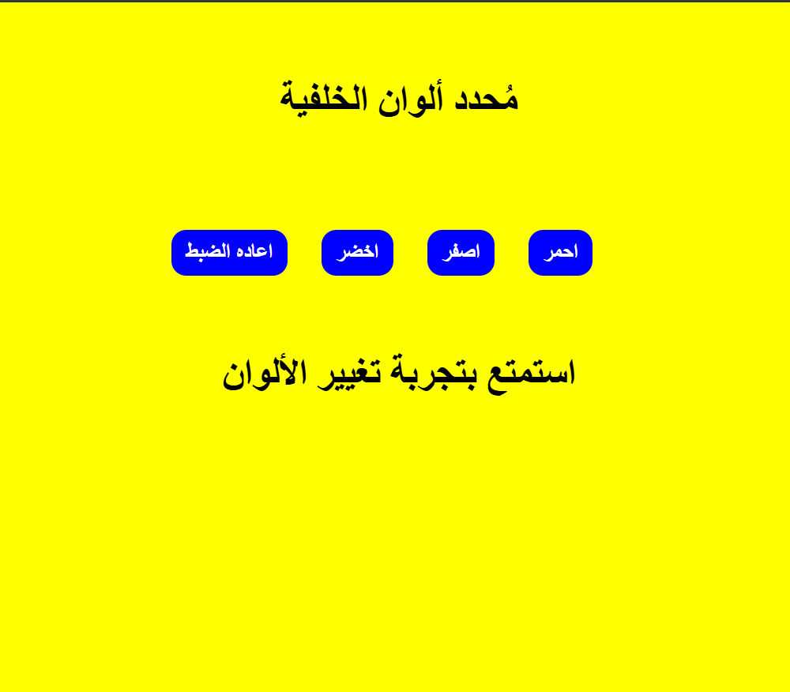

# Color Preference App

A minimal Arabic (RTL) background color picker that remembers the user's color preference across page refreshes using the browser's localStorage API.

## Task Specifications
Build a color preference app with a set of color buttons and a reset button. When the user clicks a color button, the page background should change to that color and the choice must be saved persistently so it is restored automatically on the next visit. The reset button should revert the background to white and clear the saved preference.

## Application Preview

## Technical Implementation
1. **localStorage Persistence:** Saves the selected color to `localStorage` on every click and reads it back on the `window load` event, restoring the user's preference instantly without any visual flash.
2. **Event Delegation:** Attaches a single click listener to the `.colors` container instead of individual buttons, using `e.target.tagName` to confirm the click target is a button before acting.
3. **Data Attribute Design:** Each color button carries a `data-color` attribute holding its color value, making the design fully scalable — new color options can be added in HTML with zero JavaScript changes required.
4. **Reset Functionality:** Restores the background to white and calls `localStorage.clear()` to wipe the saved preference entirely.

## Technologies Used
- HTML5 (Data attributes, Semantic structure, RTL layout)
- CSS3 (Flexbox layout, Button hover transitions)
- JavaScript (localStorage API, Event Delegation, DOM Manipulation)
