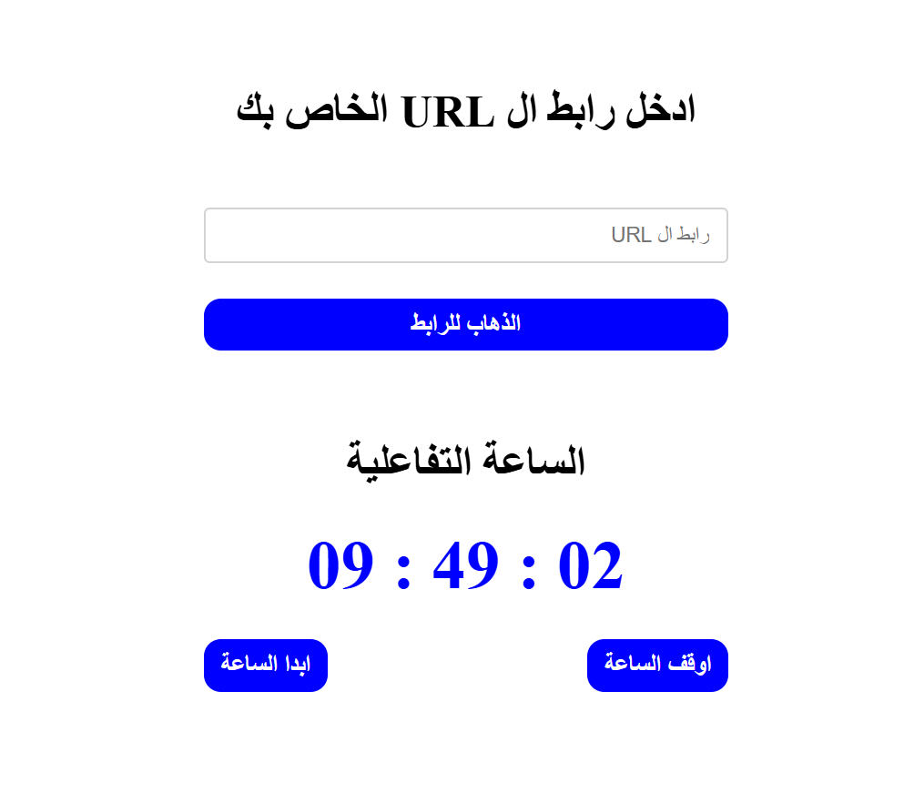

# Dynamic Clock & URL Manager

A responsive, Arabic (RTL) dual-utility web application combining an interactive live digital clock with a URL navigation tool.

## Task Specifications
Build a two-section utility page. The first section is a URL input form that navigates the browser to any valid URL the user provides. The second section is a live digital clock that displays the current time in HH:MM:SS format. The clock must have Start and Stop control buttons and the time display must always show two-digit formatting.

## Application Preview

## Technical Implementation
1. **Live Digital Clock:** Uses `setInterval` to call `new Date()` repeatedly and update the display in real time, with manual two-digit formatting applied to hours, minutes, and seconds via ternary operators.
2. **Clock Controls:** Start button launches the interval and begins ticking; Stop button calls `clearInterval()` to freeze the clock at the current time.
3. **URL Navigation:** Uses `location.replace()` to navigate the browser to a user-provided URL, using `e.preventDefault()` to intercept the form submission and a `clearInput()` validation helper to block empty inputs.

## Technologies Used
- HTML5 (Form, Inputs, Semantic structure, RTL layout)
- CSS3 (Flexbox layout, Interactive button transitions)
- JavaScript (Date API, `setInterval` / `clearInterval`, DOM Manipulation)
