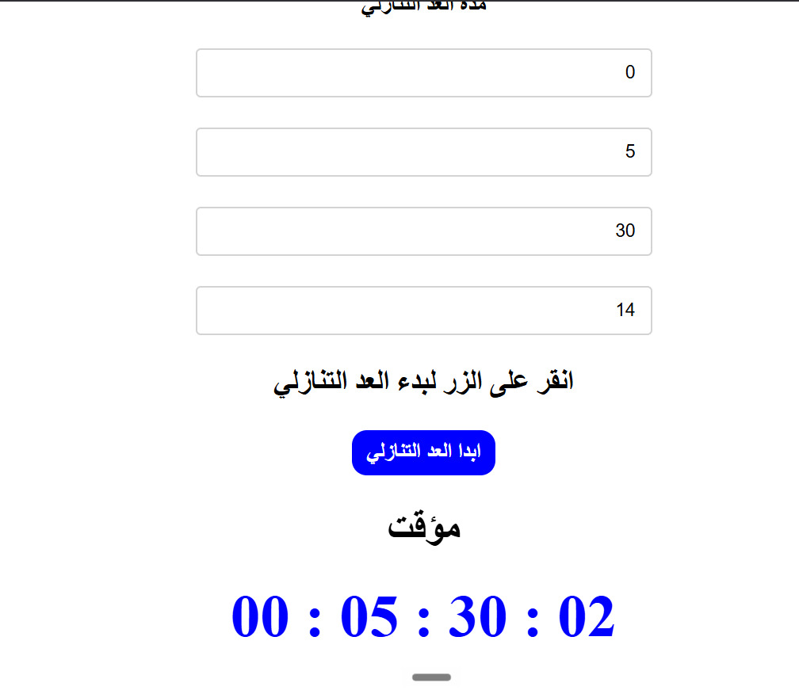

# Event Countdown Timer

A responsive, Arabic (RTL) countdown timer application that allows users to define a future event by adding days, hours, minutes, and seconds, tracking the remaining time live on the screen.

## Task Specifications
Build a web application where users can input the name of an upcoming event alongside a specific duration (Days, Hours, Minutes, Seconds). When the user starts the timer, the application must compute the target date in the future, initiate a countdown interval, and dynamically render the remaining time on the screen in `DD : HH : MM : SS` format. The timer must handle edge cases, such as the user restarting the timer while one is already running, and it must clear itself and display a completion message when the countdown reaches zero. 

## Application Preview

## Technical Implementation
1. **Dynamic Date Computation:** Uses the native JavaScript `Date` object to calculate a target time in the future by taking the current date/time and actively adding the user's numeric inputs using `.setDate()`, `.setHours()`, etc.
2. **Interval Management:** Employs `setInterval` to recalculate the time difference every 500ms. Crucially, it tracks the active interval instance (`let interval`) and calls `clearInterval(interval)` *before* starting a new one. This safely prevents the common bug where multiple asynchronous intervals stack and cause erratic behavior.
3. **Time Math & Formatting:** Converts the raw millisecond difference into human-readable days, hours, minutes, and seconds using modulo (`%`) and division mathematics. It utilizes ternary operators to manually zero-pad numbers smaller than 10 for a clean digital display.
4. **Completion Handling:** Actively checks if the time difference `diff` has dropped to 0 or below. Once reached, it safely clears the interval, wipes the timer display, and updates the event name text to notify the user that the event has ended.
5. **Validation Guards:** Uses a `clearInput()` helper to ensure an event name is provided (alerting the user if not) and checks that all numeric time inputs are non-negative before initiating the countdown.

## Technologies Used
- HTML5 (Number Inputs, Semantic Structure, RTL Layout)
- CSS3 (Flexbox Layout, Button Transitions, LTR alignment for the clock display)
- JavaScript (Date Object API, `setInterval` / `clearInterval`, Mathematical Time Conversion, DOM Manipulation)
