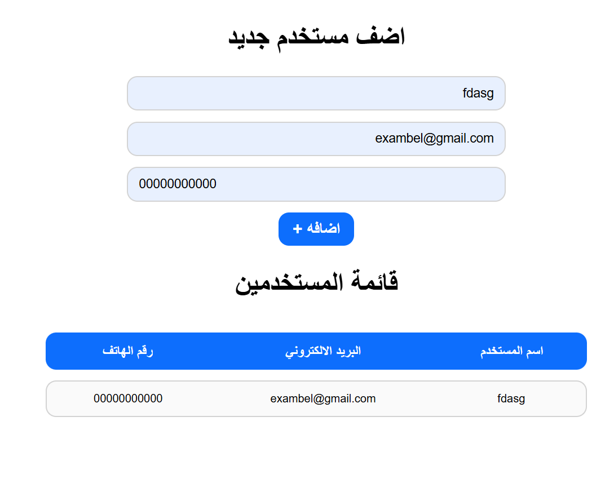

# Form Validation

A responsive, Arabic (RTL) user registration form that implements strict regular expression (RegEx) validation before adding users to a dynamically rendered table.

## Task Specifications
Build a user registration interface with a form to capture a user's name, email, and phone number. When the form is submitted, validate the inputs against strict criteria using Regular Expressions: the name must be 3-10 characters long (letters and spaces only), the email must follow a standard valid format, and the phone number must be exactly 11 digits. If any validation fails, alert the user with a specific error message. If all validations pass, dynamically generate a new table row and append the user's details to the user list.

## Application Preview

## Technical Implementation
1. **RegEx Validation Engine:** Employs a single, versatile `clearInput()` utility function that takes the input value and its expected `type`. It applies specific Regular Expressions to strictly validate the format of names, emails, and phone numbers.
2. **Form Interception:** Uses `e.preventDefault()` on the Add button to stop the default form submission behavior, allowing the JavaScript validation logic to run first.
3. **Targeted Error Handling:** Returns `null` from the validation helper if an input fails its RegEx check. The submission handler then detects the `null` value and halts execution, displaying a targeted alert message corresponding to the specific field that failed.
4. **Dynamic Table Rendering:** If validation passes, the application dynamically constructs an HTML table row (`<tr>`) using a template literal and appends the validated data directly into the DOM table body.

## Technologies Used
- HTML5 (Forms, Input Types, Semantic Table Structure, RTL Layout)
- CSS3 (Flexbox Layout, Clean Table Styling, Hover Transitions)
- JavaScript (Regular Expressions, Form Validation, DOM Manipulation, Template Literals)
