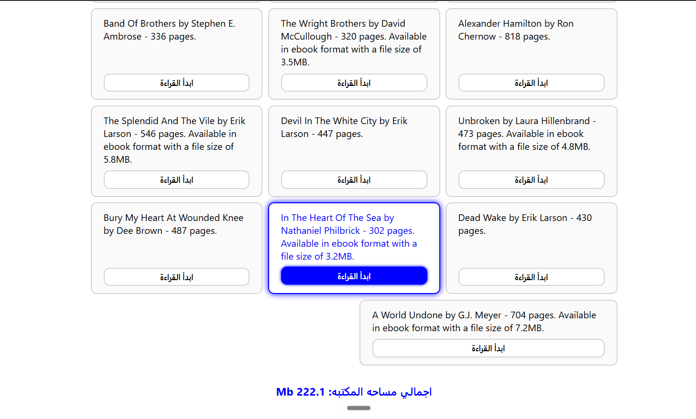

# Library Management

An object-oriented library catalog application that demonstrates ES6 class inheritance, polymorphism, and array reduction to dynamically display a vast collection of books and calculate total server storage requirements.

## Task Specifications
Build a digital library application initialized with an array of 100 books. The data structure must differentiate between physical books and digital ebooks. Create a base `Book` class and an extended `Ebook` subclass that includes a file size property. Dynamically loop through the library array and render each book to the DOM as a card. Using array reduction, calculate the total file size in megabytes for all `Ebook` instances combined and display this metric at the bottom of the interface.

## Application Preview

## Technical Implementation
1. **ES6 Inheritance & Subclassing:** Implements a base `Book` class containing common properties (title, author, pages) and methods. An `Ebook` class extends `Book`, invoking `super()` to inherit properties while introducing a unique `fileSize` property and overriding the detail-fetching method.
2. **Polymorphic Rendering:** Iterates over a mixed array of 100 object instances. Utilizes the `instanceof` operator to intelligently determine whether each object is a standard `Book` or an `Ebook`, calling the appropriate, overridden method (`getEbookDetails()` vs `getDetails()`) dynamically.
3. **Advanced Array Reduction:** Employs the `reduce()` higher-order function in conjunction with `instanceof` to surgically extract and sum only the `fileSize` properties of the `Ebook` objects, efficiently computing the total megabyte footprint of the digital library.
4. **Responsive Grid Architecture:** Relies heavily on CSS Flexbox (`flex: 1 0 30%` and `flex-wrap`) to generate a fluid, responsive masonry-style grid for the 100 book cards without rigid breakpoints.

## Technologies Used
- HTML5 (Semantic Structure, Embedded Spans)
- CSS3 (Flexbox Wrapping, Card Styling, Direction Reversal for LTR content in RTL layout)
- JavaScript (ES6 Classes, `extends`, `super`, `instanceof`, `reduce`, Array Iteration, DOM Element Generation)
