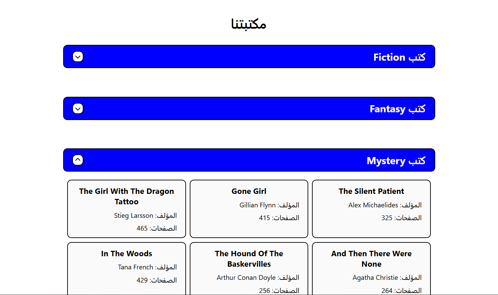

# Interactive Library System

A comprehensive, Arabic (RTL) library management web application that displays categorized book collections, calculates global statistics, and allows users to dynamically add new books and sections.

## Task Specifications
Develop a library system initialized with a complex nested dataset of books categorized by genre. The application should render these sections as collapsible (accordion-style) UI elements. It must calculate and display the total number of pages across all books in the library. Users should be able to add a new book via a form. If the book already exists, alert the user. If the specified genre exists, append the book to it; if not, dynamically create a new genre section. Ensure all user inputs are cleaned and correctly capitalized.

## Application Preview

## Technical Implementation
1. **Complex State Management:** Handles a deeply nested array of objects (`Library`), rendering multiple genres (Fiction, Fantasy, Sci-Fi, etc.) and their respective book lists dynamically.
2. **DOM Manipulation & Accordion UI:** Implements a collapsible accordion interface using Event Delegation on the parent container. It toggles CSS classes and dynamically calculates `scrollHeight` to animate the opening and closing of book sections.
3. **Advanced Array Methods (`.reduce()`):** Uses nested `.reduce()` methods to traverse the complex data structure and accurately calculate the total number of pages across the entire library in real-time.
4. **Data Validation & Formatting:** Features a custom `clean()` function that trims whitespace and forces Title Case formatting (capitalizing the first letter of each word) for consistent data entry and duplicate checking.
5. **Dynamic Updates:** When a user submits the form, the script validates against duplicates, pushes the new data to the state array, recalculates the global page count, and surgically updates only the necessary DOM elements without requiring a full page reload.

## Technologies Used
- HTML5 (Forms, Semantic structure, RTL layout)
- CSS3 (Flexbox, CSS Variables for dynamic heights, Accordion transitions)
- JavaScript (ES6+ Nested Arrays/Objects, `.reduce()`, `.map()`, String Manipulation, Event Delegation, DOM Rendering)
- FontAwesome (Icons)
