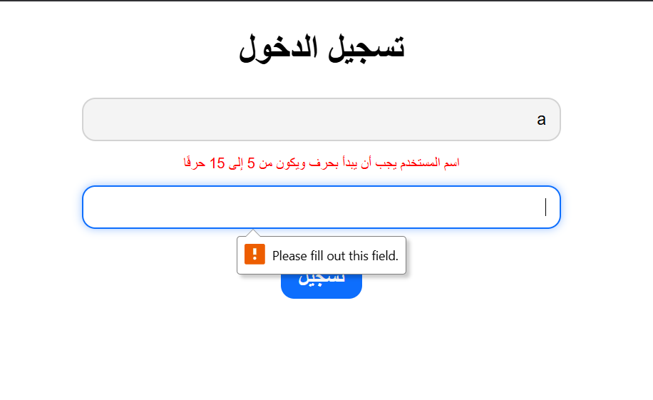

# Login Form Validation

A responsive, Arabic (RTL) login interface that implements strict Regular Expression (RegEx) validation and provides immediate, inline feedback to the user without relying on disruptive alert popups.

## Task Specifications
Build a login form to capture a username and password. When the form is submitted, validate the inputs against strict RegEx criteria: the username must start with a letter and be 5-15 alphanumeric characters long; the password must be 8-20 characters long and contain at least one uppercase letter and one number. If validation fails, intercept the form submission and display specific error messages directly beneath the offending input field. If validation succeeds, allow the form to submit naturally.

## Application Preview

## Technical Implementation
1. **RegEx Validation Engine:** Uses a `clearInput()` utility to strictly enforce username and password formatting rules using Regular Expressions.
2. **Form `submit` Interception:** Listens for the `submit` event directly on the `<form>` element rather than tracking button clicks, aligning with native web standards.
3. **Conditional Execution:** Dynamically calls `e.preventDefault()` *only* if a validation check fails. This allows valid submissions to pass through natively to the server without requiring manual JavaScript routing.
4. **Inline Error Messaging:** Improves UX by dynamically injecting targeted error strings into dedicated `
` tags positioned beneath each input, completely avoiding intrusive `window.alert()` popups.

## Technologies Used
- HTML5 (Forms, Password Input Types, RTL Layout)
- CSS3 (Flexbox Layout, Input Focus States, Form Styling)
- JavaScript (Regular Expressions, Conditional Event Prevention, DOM Manipulation)
