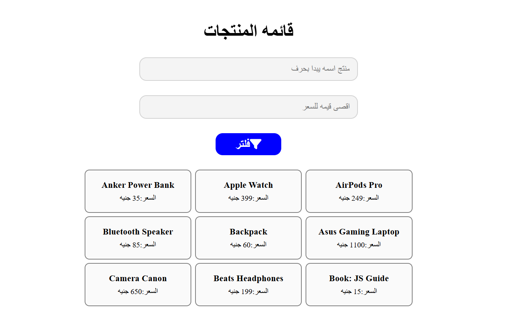

# Product Display & Filtering

A responsive Arabic (RTL) e-commerce web application that dynamically renders a list of products and allows users to search and filter them by name (starting letter) or maximum price.

## Task Specifications
Build a product display application that renders a list of items to the page. Include two input fields: one for a text search and one for a maximum price limit, along with a filter button. When the user clicks the filter button, the application should dynamically update the displayed products to only show those that match the active criteria. The user must provide at least one filter criterion. If no products match the criteria, display a polite alert message.

## Application Preview

## Technical Implementation
1. **Dynamic DOM Generation:** Loops through a hardcoded array of 35 product objects (`name`, `price`) and uses a custom `display()` function to generate and append HTML structures (`div`, `h3`, `p`) to the DOM.
2. **Advanced Array Filtering:** Uses the ES6 `.filter()` method to scan the products array dynamically. It checks if a product name `.startsWith()` the text input (using `.toLowerCase()` and `.trim()` for safety) and if the product price is less than or equal to the numeric input.
3. **Form Validation & UX:** Alerts the user if they try to filter without entering any values. Clears the DOM before rendering new results, and alerts the user if their specific search yields zero results.
4. **Responsive Grid Layout:** Utilizes CSS Flexbox with `flex-wrap: wrap` to ensure the dynamically generated product cards align neatly across various screen sizes.

## Technologies Used
- HTML5 (Inputs, Semantic structure, RTL layout)
- CSS3 (Flexbox Grid, Interactive states, custom hover/focus animations)
- JavaScript (ES6+ Arrays, High-Order Functions `.filter()` & `.forEach()`, String Methods, DOM Manipulation)
- FontAwesome (Icons)
