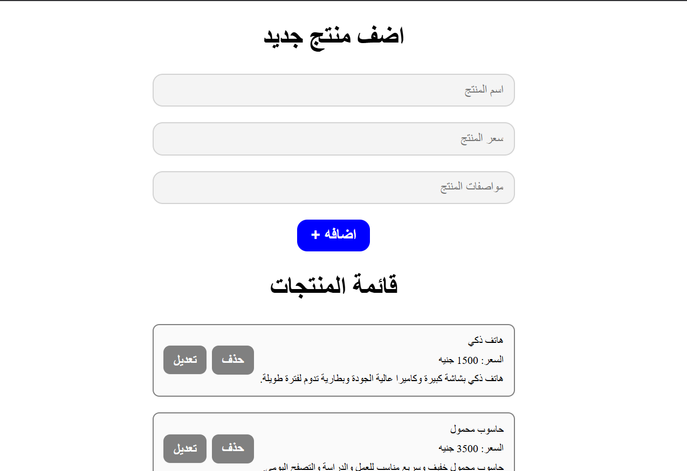

# Product List Manager

A responsive, Arabic (RTL) product management dashboard that allows users to perform full CRUD operations (Create, Read, Update, Delete) on an inventory list of technology products.

## Task Specifications
Build a product management list initialized with an array of products. The interface should have text inputs for product name, price, and description, along with an add button. The application must dynamically display the items. Users should be able to delete items from both the DOM and the underlying data array. Users must also be able to edit items: clicking an edit button should populate the form fields and allow the user to save changes, updating the item in place. Implement validation to prevent duplicate products from being added or updated.

## Application Preview

## Technical Implementation
1. **Dynamic CRUD Operations:** Implements complete Create, Read, Update, and Delete capabilities on a local state array (`products`) and mirrors all changes seamlessly in the DOM.
2. **State-Driven Editing UI:** Uses a temporary pointer variable (`elementToEdit`) to track which item is being modified. Populates the input form and toggles button visibility (hiding Add and showing Approve Edit). Uses an `<a href="#title">` anchor link to smoothly scroll the user back to the form without a page jump.
3. **Array Mutation & Matching:** Leverages ES6 methods like `.findIndex()` to locate products in memory by matching name, price, and description, and uses `.splice()` for secure deletion.
4. **Duplicate Prevention & Validation:** Validates form values using a custom `clearInput()` helper and performs duplicate check scans during both Add and Edit phases, preventing identical items from cluttering the list.

## Technologies Used
- HTML5 (Inputs, Semantic container structure, RTL layout)
- CSS3 (Smooth scroll behavior, Interactive transition states, Flexbox layout)
- JavaScript (ES6+ Arrays, High-Order Functions, Event Delegation, DOM Manipulation)
- FontAwesome (Icons)
