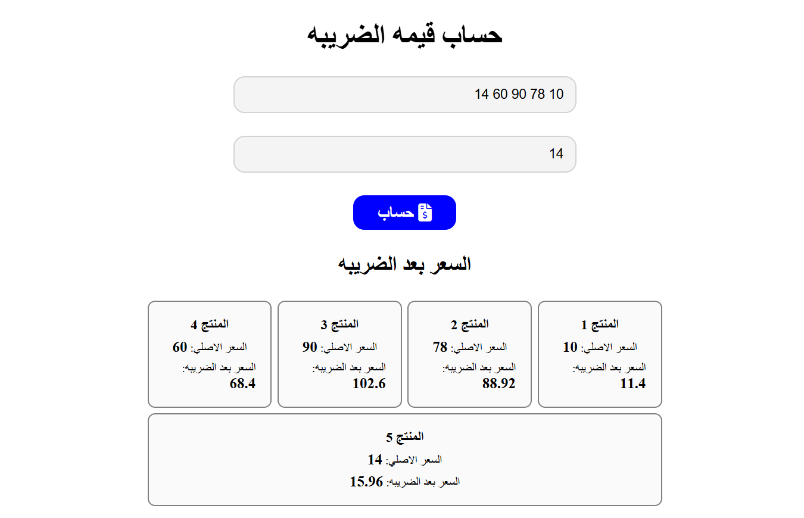

# Product Pricing (Tax Calculator)

A responsive Arabic (RTL) utility application that calculates and applies a tax percentage to a batch of product prices simultaneously.

## Task Specifications
Develop a tax calculator that accepts a space-separated list of product prices and a tax percentage. When the user clicks the calculate button, the application should process the string of prices, calculate the final price after tax for each product, and dynamically display the original and final prices in a grid layout. The application must handle invalid inputs gracefully.

## Application Preview

## Technical Implementation
1. **String Parsing & Validation:** Takes a single string of space-separated prices, uses `.split(' ')` to create an array, and uses `.filter()` to remove any empty spaces or invalid non-numeric entries (`!isNaN`).
2. **Data Transformation:** Uses the ES6 `.map()` array method to iterate over the validated numeric prices, calculating the final price for each by applying the user-defined tax percentage.
3. **Dynamic DOM Rendering:** Iterates over the arrays in a `display()` function, using template literals to construct `
` elements containing both the original and post-tax prices, and appends them to the DOM.
4. **Form Validation & UX:** Alerts the user politely if either the prices input or the tax percentage is left blank before attempting to calculate.

## Technologies Used
- HTML5 (Inputs, Semantic structure, RTL layout)
- CSS3 (Flexbox Grid, Interactive states, custom hover/focus animations)
- JavaScript (ES6+ Arrays, High-Order Functions `.split()`, `.filter()`, `.map()`, DOM Manipulation)
- FontAwesome (Icons)
