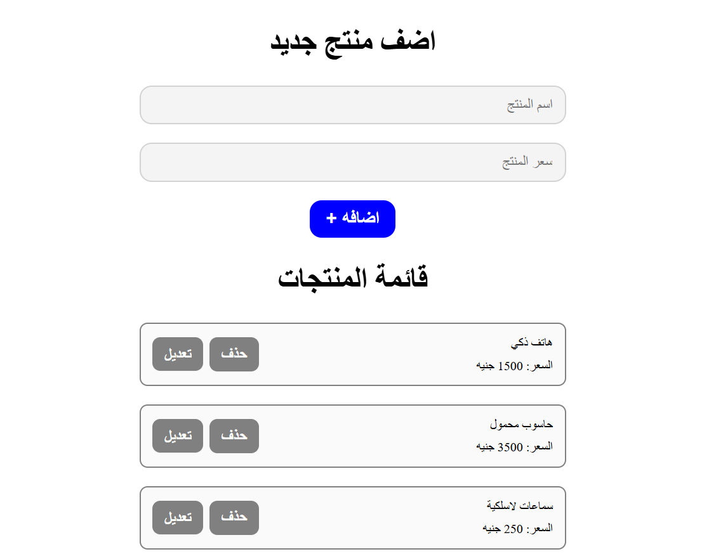

# Product Tracker

A responsive, Arabic (RTL) product tracking dashboard that allows users to manage a list of products with their prices, while automatically calculating the total cost of all products.

## Task Specifications
Build a product management tracker that initializes with a predefined list of products. The interface should have text inputs for the product name and price, along with an Add button. The application must dynamically display the items and maintain a running total of the overall cost. Users should be able to delete items, which will remove them from the list and subtract their price from the total. Users must also be able to edit items: clicking an edit button should populate the form fields, smoothly scroll to the top, and allow the user to save changes, updating the item in place and adjusting the total cost accordingly. Implement validation to prevent duplicate product names.

## Application Preview

## Technical Implementation
1. **Advanced State Management:** Utilizes a `Set` to track unique product names (preventing duplicates) and a `Map` to associate product names with their prices, moving away from traditional array-based state.
2. **Optimized DOM Rendering:** Instead of re-rendering the entire list when a new product is added, the application efficiently creates and appends only the new product element to the DOM.
3. **Dynamic Total Calculation:** Maintains a running total cost that dynamically updates when items are added, deleted, or when their prices are modified during an edit.
4. **State-Driven Editing UI:** Uses a pointer (`elementToEdit`) to track the product being modified. The edit button is an `<a href="#title">` anchor that leverages CSS `scroll-behavior: smooth` to glide the user back to the input form. During an edit, if an input field is left empty, the application falls back to the original value using the nullish coalescing operator (`??`).
5. **Event Delegation:** Attaches a single click listener to the product list container to handle both edit and delete actions efficiently.

## Technologies Used
- HTML5 (Inputs, Semantic container structure, RTL layout)
- CSS3 (Smooth scroll behavior, Interactive transition states, Flexbox layout)
- JavaScript (ES6+ Sets, Maps, Nullish Coalescing, Event Delegation, DOM Manipulation)
- FontAwesome (Icons)
