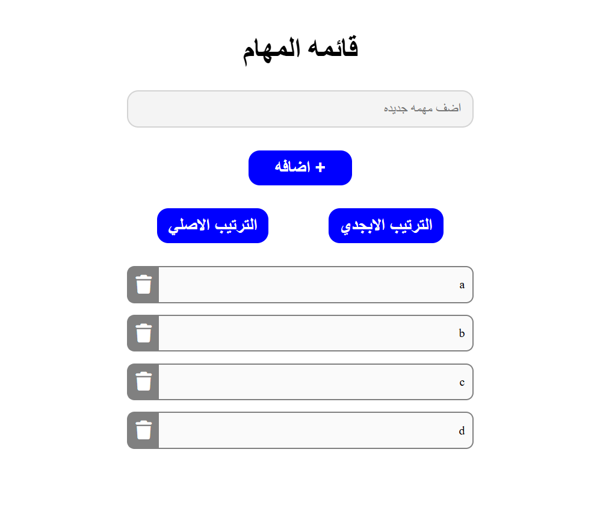

# Interactive To-Do List

A responsive, Arabic (RTL) task management web application that allows users to add, delete, and sort daily tasks efficiently.

## Task Specifications
Develop a To-Do list application where users can input tasks. The app should validate inputs to prevent empty or duplicate tasks. Include the ability to delete individual tasks. When two or more tasks are present, dynamically display options to sort the tasks alphabetically or revert them to their original chronological order.

## Application Preview

## Technical Implementation
1. **DOM Elements & Event Listeners:** Attaches click event listeners to the "Add" button, "Sort" buttons, and dynamically generated "Delete" buttons to handle user interactions.
2. **Array State Management:** Uses a JavaScript array (`tasks`) to store the raw data (state) of the list. New tasks are added using `.push()` and removed using `.splice()`. 
3. **Input Validation:** Trims user input and uses `tasks.includes()` to prevent the addition of duplicate or empty tasks, alerting the user if validation fails.
4. **Dynamic DOM Rendering:** Constructs task elements dynamically using `document.createElement()` and `innerHTML`, and manages their appearance in the `.taskList` container.
5. **Sorting Logic:** Uses the spread operator `[...tasks].sort()` to create a sorted copy of the tasks without mutating the original array, allowing the user to seamlessly toggle between alphabetical and chronological views.

## Technologies Used
- HTML5 (Semantic elements & RTL document structure)
- CSS3 (Flexbox layout, interactive states, transitions, & custom hover effects)
- JavaScript (ES6+ Arrays, Spread Operator, DOM Creation & Manipulation, Event Handling)
- FontAwesome (Icons)
