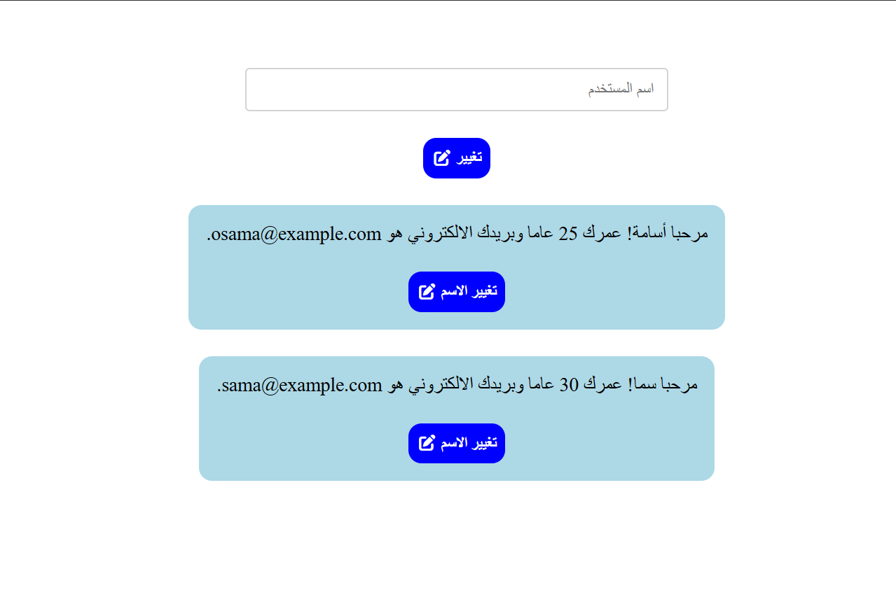

# User Constructor

A simple, object-oriented user management application that demonstrates ES6 classes, instantiation, and dynamic DOM manipulation based on state arrays.

## Task Specifications
Build a small application that uses an ES6 JavaScript `class` to define a user with properties for name, age, and email, along with a method that returns a formatted greeting string. Initialize an array of these user objects and render them to the screen as cards. Provide a text input and a "change" button at the top of the interface. Users should be able to click an edit button on any specific card, type a new name in the input field, and submit the change. The application must identify which user object was selected, update its name property, and re-render the card with the updated greeting.

## Application Preview

## Technical Implementation
1. **ES6 Classes & Methods:** Implements a `user` class structure to define the shape and behavior of user data, utilizing a constructor for initialization and a `message()` method to generate the display text dynamically.
2. **State Identification by Value:** When a user initiates an edit, the application uses event delegation (`closest()`) to find the specific card and then leverages `.findIndex()` to match the exact string returned by the `message()` method against the instances in the state array, determining the precise index of the object being edited.
3. **Safety Guards:** Includes a fail-safe check to alert the user if they attempt to submit a name change before explicitly selecting a card to edit, preventing uninitialized variable crashes (`card.remove()` on `undefined`). Input validation also ensures empty strings cannot be submitted.
4. **Dynamic Re-rendering:** Upon a successful edit, the targeted JavaScript object is updated in memory, its old DOM representation is deleted, and a fresh card is generated and appended to reflect the new state.

## Technologies Used
- HTML5 (Inputs, Semantic Layout, RTL orientation)
- CSS3 (Flexbox Layout, Card Styling, Interactive Button Transitions)
- JavaScript (ES6 Classes, Array Iteration, Event Delegation, Object-Oriented Patterns)
