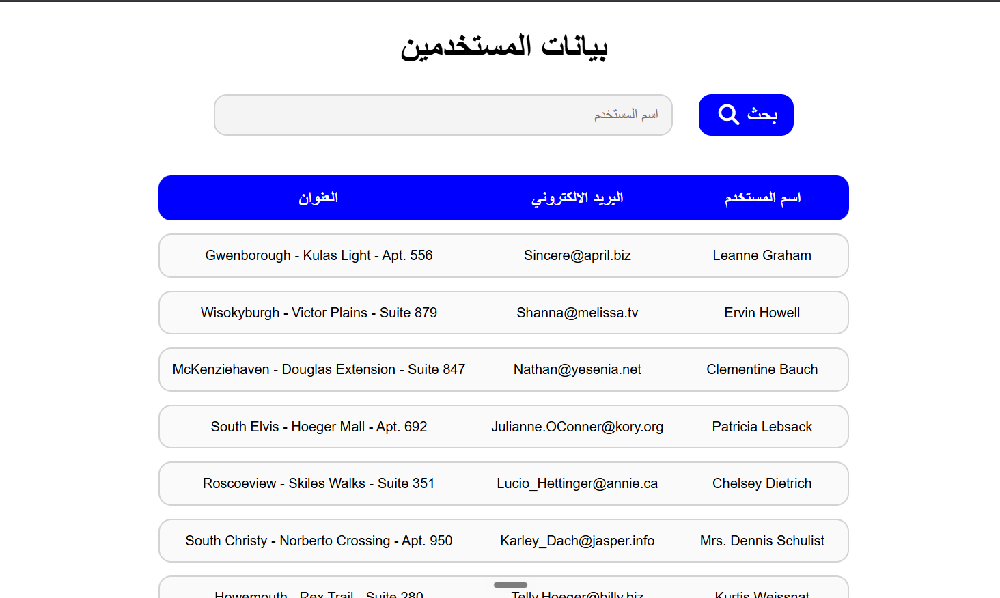

# User Information Fetcher

A dynamic, API-driven web application that fetches user data from a remote server asynchronously and provides a seamless, client-side search functionality to filter and display the results in a formatted table.

## Task Specifications
Build an application that connects to an external REST API (JSONPlaceholder) to retrieve a list of user objects. The fetching process must be fully asynchronous and include robust error handling for both the network request and the JSON parsing phase. Once fetched, dynamically render the user data (Name, Email, and Address) into an HTML table. Implement a search feature that allows the user to filter the displayed table by the user's name (case-insensitive string matching), updating the DOM dynamically without reloading the page.

## Application Preview

## Technical Implementation
1. **Asynchronous API Integration:** Utilizes modern `async/await` syntax and the `fetch` API to retrieve data from a remote server. It features strict, nested `try...catch` blocks to independently handle HTTP connection errors (checking `!response.ok`) and JSON parsing errors, ensuring the application fails gracefully.
2. **Client-Side State Management:** Caches the fetched API payload in a global `result` variable. This allows the search function to filter the data instantly on the client side without making redundant, expensive network requests to the server for every search query.
3. **Dynamic Filtering:** Employs the `Array.prototype.filter()` higher-order function combined with `.toLowerCase()` and `.startsWith()` to execute case-insensitive string matching against the user's name.
4. **DOM Rendering & Reset:** Uses `.map()` and template literals to construct table rows dynamically. When a search is executed, the application rapidly clears the existing table body (`tbody.innerHTML = ''`) before appending the newly filtered result set.

## Technologies Used
- HTML5 (Semantic Tables, Inputs)
- CSS3 (Advanced Table Formatting, Hover States, Transitions)
- JavaScript (Async/Await, Fetch API, Error Handling, Array Filtering, DOM Manipulation)
