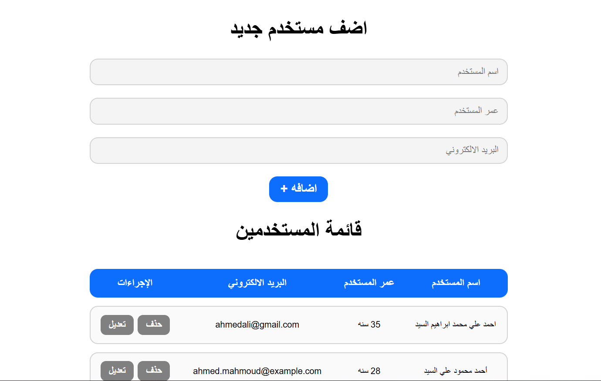

# User Management System

A responsive, Arabic (RTL) admin dashboard that allows users to perform full CRUD operations (Create, Read, Update, Delete) on a registry of users using a modern tabular layout.

## Task Specifications
Build a user management system initialized with an array of users. The interface must include form input fields for User Name, Age, and Email, along with an add button. The application must display the users in a structured table. Implement delete functionality to remove users from both the DOM and the state array. Implement edit functionality that populates the input fields with the selected user's details and saves edits in place. Include validation to prevent duplicate users with identical details.

## Application Preview

## Technical Implementation
1. **Tabular DOM Generation:** Generates and appends HTML `<tr>` and `<td>` elements to a table body (`tbody`) using a template literal structure to display user names, ages, and emails dynamically.
2. **State-Driven Editing UI:** Tracks the active row using a `userToEdit` pointer. Toggles the add/edit buttons and pre-fills the input fields with the selected user's current details when editing is initiated.
3. **Data Cleansing & Validation:** Employs a custom `clearInput()` helper that sanitizes inputs by removing outer whitespace. Validates that all fields are fully filled before processing any submissions.
4. **Duplicate Safeguards:** Utilizes `.findIndex()` to prevent duplicate entries with identical names, ages, and emails during both the creation of new users and the modification of existing entries.

## Technologies Used
- HTML5 (Inputs, Semantic Tables, RTL layout)
- CSS3 (Custom table layout, Border and box-shadow hover transitions, Smooth scrolling)
- JavaScript (ES6+ Arrays, High-Order Functions, Event Delegation, DOM Rendering & Manipulation)
- FontAwesome (Icons)
