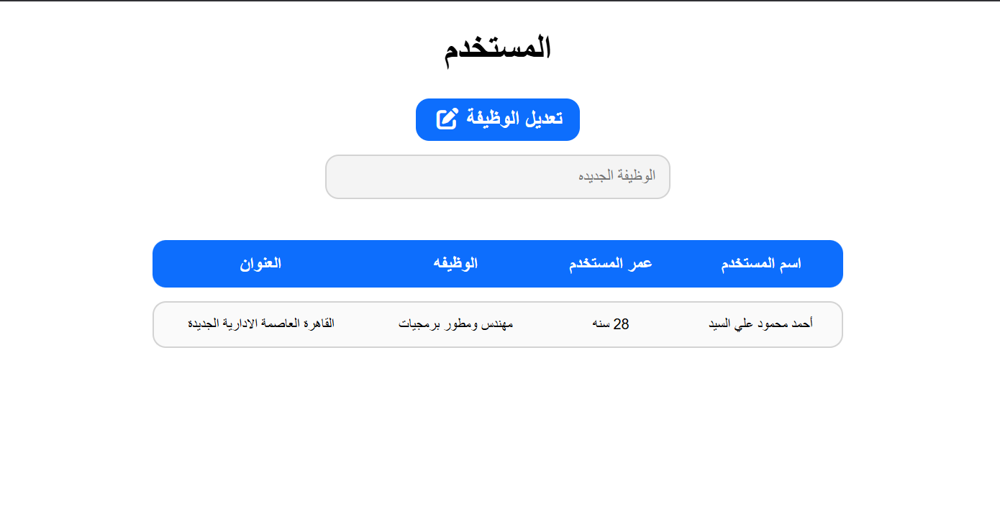

# User Profile Viewer

A focused, single-user profile dashboard (RTL layout) that allows for real-time updates to specific user properties, specifically the user's job title.

## Task Specifications
Build a profile viewer that displays a user's information (Name, Age, Job, Address) in a clean tabular format. Include a form with a text input and a submit button to update the user's job title. When submitted, the application should validate the input (preventing empty submissions) and instantly update both the DOM display and the underlying JavaScript user object state without reloading the page.

## Application Preview

## Technical Implementation
1. **Dynamic Tabular Rendering:** Utilizes template literals to inject a JavaScript state object (`user`) into an HTML table row dynamically on page load.
2. **Targeted DOM Updates:** Listens for form submissions, intercepts them using `e.preventDefault()`, and updates only the specific `.job` cell in the DOM to reflect changes instantly.
3. **State Synchronization:** Ensures that when the DOM is updated, the underlying `user.job` property in the JavaScript object is updated concurrently to keep data and UI synchronized.
4. **Input Validation:** Implements a `clearInput()` helper that sanitizes input and a conditional check in the submit handler that alerts the user and halts execution if an invalid or empty job title is provided.

## Technologies Used
- HTML5 (Forms, Semantic Tables, RTL Layout)
- CSS3 (Flexbox layout, Interactive button transitions, Clean table styling)
- JavaScript (DOM Manipulation, Event Handling, Input Validation)
