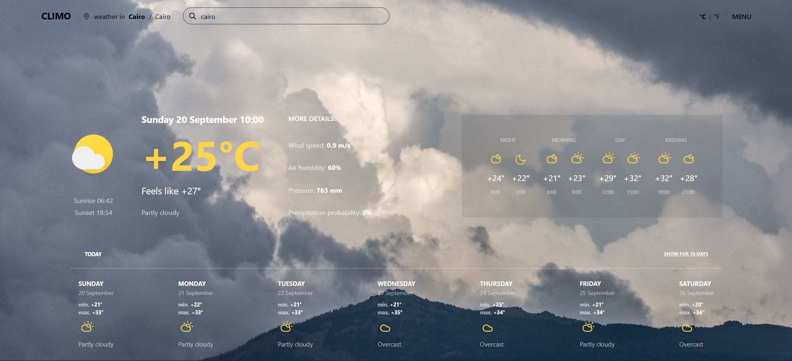

# Climo Weather Dashboard

A responsive, full-screen weather dashboard that allows users to search for locations by continent, country, and city, then view current weather conditions, hourly forecasts, and an expandable 16-day forecast with Celsius/Fahrenheit switching.

## Task Specifications

Build a weather application initialized with a grouped dataset of continents and countries. The interface must allow the user to select a continent, filter/search countries, and search cities using an external geocoding API. After a city is selected, the application must fetch current weather, hourly forecast, and daily forecast data from a weather API.

The dashboard must display the current temperature, feels-like temperature, weather description, weather icon, sunrise time, sunset time, wind speed, air humidity, pressure, and precipitation probability. It must also include a Celsius/Fahrenheit toggle that persists across sessions.

The application should cache the latest weather response for a limited time and restore the last selected location on reload. It should also support browser geolocation on first visit, handle loading and error states, and provide a reset action. The forecast section should show 7 days by default and allow the user to expand the view to 16 days. The layout must use a fixed full-screen background with internal scrolling areas.

## Application Preview




## Technical Implementation

1. **Hierarchical Location Filtering:** Uses a local `countriesData` module grouped by continent to filter countries dynamically. Selecting a continent updates the country list, clears previous city/state data, and highlights the active continent using the `.active-li` class.

2. **Country & City Search UI:** Implements searchable country and city inputs. Country filtering is handled locally from the selected continent, while city suggestions are fetched from the GeoNames API based on the user's input and the selected country code. Results are rendered inside a custom dropdown with styled scrollbars.

3. **Asynchronous Weather Fetching:** Uses `fetch()` with `async/await` to request weather data from the Open-Meteo API. The request retrieves current weather, hourly data, and 16 days of daily forecast data using the selected city's latitude and longitude. The API uses `timezone=auto` to return time values relative to the selected location.

4. **State-Driven Weather Rendering:** Stores the API response in a `weatherData` state object. Dedicated rendering functions update the current weather panel, hourly forecast slots, and daily forecast cards. Temperature formatting, weather-code descriptions, and icon selection are handled through reusable helper functions.

5. **Weather Code Mapping:** Maps Open-Meteo weather codes to human-readable descriptions and icon assets using lookup tables. Separate icon sets are used for the main current weather display and the smaller outline icons used in the hourly/daily forecast sections. Day and night icons are selected based on the `is_day` value.

6. **Celsius/Fahrenheit Toggle:** Converts temperatures using a `celsiusToFahrenheit()` helper and updates all displayed temperature values when the user switches units. The selected unit is saved to `localStorage` so it persists after the page is reloaded.

7. **Persistent Location & Session Cache:** Saves the last selected location in `localStorage` and stores the latest weather payload in `sessionStorage` with a 15-minute TTL. On reload, the app restores the saved temperature unit, location, and valid cached weather data before deciding whether to fetch fresh data.

8. **Browser Geolocation & Reverse Geocoding:** On first visit, the app can request the user's browser coordinates. It then reverse geocodes the coordinates using GeoNames, maps the returned country code to the local continent/country dataset, fills the location UI, saves the detected location, and loads the weather automatically.

9. **Dynamic 7/16-Day Forecast Expansion:** Renders the first seven days using existing markup and generates additional days by cloning a template table cell. The "SHOW FOR 16 DAYS" toggle dynamically appends or removes generated day cards and updates the button label accordingly.

10. **Loading, Error, and Reset States:** Clears weather-related UI fields while new data is being fetched and displays error messages if API requests fail. The app logo acts as a reset button, removing saved location/cache data and reloading the application to its initial state.

11. **Fixed Background App Shell:** The `<body>` uses Tailwind utilities such as `bg-[url('./assets/images/background.jpg')]`, `bg-cover`, `bg-no-repeat`, `bg-center`, `bg-fixed`, `min-h-dvh`, `md:h-dvh`, `md:overflow-hidden`, `font-sans`, and `flex flex-col` to create a full-viewport dashboard with a fixed background image. On desktop, the outer page height is locked and internal scrollable areas handle overflow.

12. **Custom Scrollbars & Responsive Menu:** Applies custom scrollbar styling for menus, city results, and forecast tables using both Firefox and WebKit scrollbar APIs. The navigation menu toggles with an `.is-open` class and animates using CSS transform/visibility transitions.

## APIs Used

### Open-Meteo API
Used as the weather data source for the selected location. A single forecast request returns:
- Current weather conditions (temperature, feels-like, weather code, wind speed, humidity, pressure, day/night state)
- Hourly forecast data (temperature, weather code, precipitation probability, day/night state)
- 16-day daily forecast (weather code, min/max temperature, sunrise, sunset, precipitation probability)

### GeoNames API
Used for all location-related features:
- `searchJSON`: searches cities by name prefix within the selected country code
- `findNearbyPlaceNameJSON`: reverse geocodes detected browser coordinates into a place name

> **Note:** Replace the GeoNames `username` parameter in `main.js` with your own GeoNames username before publishing the project.

## Styling Approach

The project uses **Tailwind CSS** as the primary styling layer for layout, spacing, typography, and the fixed full-screen background shell. The `<body>` element defines the main app shell:

```html
<body class="bg-[url('./assets/images/background.jpg')] bg-cover bg-no-repeat bg-center bg-fixed min-h-dvh md:h-dvh md:overflow-hidden font-sans flex flex-col">
```

A custom `style.css` layer complements Tailwind for behavior that utilities cannot express:
- Custom scrollbar styling (Firefox `scrollbar-*` properties and WebKit pseudo-elements)
- Slide-in navigation menu transitions (`transform`, `visibility`, `opacity`)
- Active continent highlight state (`.active-li`)
- Animated city-results dropdown (`max-height` on focus)
- Responsive weekly-forecast column sizing using CSS variables (`--reserve`, `--grow`) and the `:has()` selector for the 7/16-day views

## Technologies Used

- HTML5 (Semantic dashboard structure, forms, lists, tables, template cloning)
- CSS3 (Custom scrollbars, transitions, responsive states, media queries, CSS variables, `:has()`)
- Tailwind CSS (Utility-first layout, arbitrary background image, dynamic viewport height, fixed background)
- JavaScript ES6+ (Modules, `async/await`, `fetch`, `Intl.DateTimeFormat`, DOM manipulation, event delegation, Web Storage API)
- Open-Meteo API (Current, hourly, and daily weather forecast data)
- GeoNames API (City search and reverse geocoding)