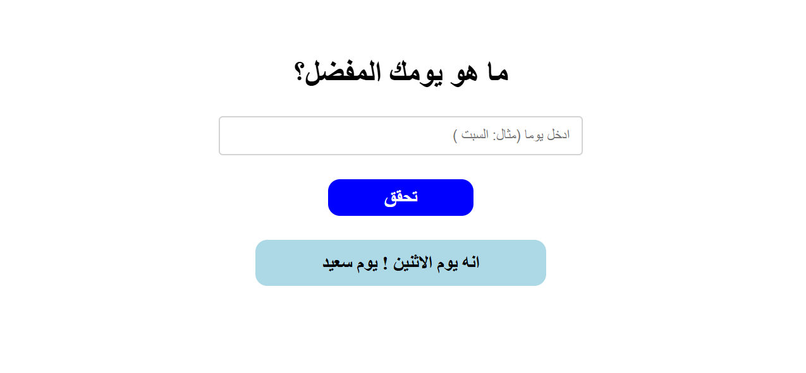

# Weekday Planner

A responsive Arabic (RTL) weekday planner web application that receives a day of the week as input and dynamically displays a customized, unique message corresponding to that day.

## Educational Objective
تعلم كيفية التحقق من أيام الأسبوع باستخدام JavaScript مع تطبيق مبادئ التحقق من المدخلات وعرض النتائج بشكل تفاعلي.

## Course Progression
- **Module:** Week 3 — Conditional Logic and Comparisons
- **Lessons Covered:** #031 to #039 (Comparison Operators, Logical Operators, If Conditions, Nested If Condition, Conditional Ternary Operator, Nullish Coalescing Operator And Logical OR, Switch Statement, Switch And If Condition Challenge)

## Task Specifications
Build a weekday planner that asks the user to input a day of the week.
For Friday, show: "It's Friday, have a blessed day!"
For Saturday or Sunday, show: "Weekend vibes! Start your week fresh."
For other days, display a unique message for that day.
Use a switch statement to handle the logic.

## Application Preview

## Technical Implementation
1. **Event Handling & DOM Manipulation:** Captures button clicks, prevents default behavior, and clears previously displayed messages from the DOM to prevent duplicates.
2. **Validation & Formatting:** Trims whitespace from the user input to ensure accurate matching and validates that the field is not empty.
3. **Switch Evaluation & Dynamic Elements:** Evaluates the inputted day using a `switch` statement (checking for days like "الجمعه", "السبت"). It creates a new `<h1>` element, applies inline styles dynamically, populates it with the corresponding customized message, and appends it to the main container.

## Technologies Used
- HTML5 (Input fields & RTL document structure)
- CSS3 (Flexbox layout, interactive states, & transitions)
- JavaScript (ES6+ Control Flow, Switch statements, DOM Creation & Manipulation)
