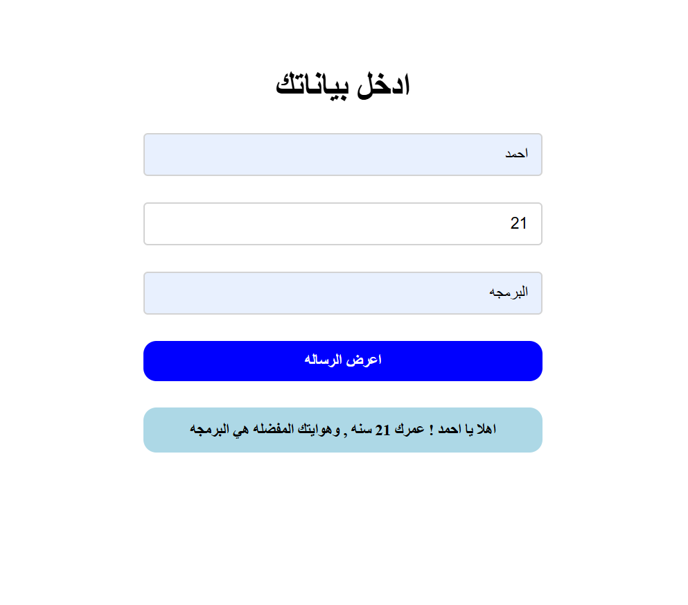

# Welcome Form

An interactive Arabic (RTL) form component that receives user details, performs input validation, and dynamically renders a personalized welcome card to the page.

## Educational Objective
تعلم كيفية معالجة مدخلات الـ Forms في JavaScript مع التحقق من الصحة وعرض النتائج بشكل تفاعلي، مع تطبيق مبادئ تصميم الواجهات الحديثة.

## Course Progression
- **Module:** Week 1 — Introduction and Fundamentals
- **Lessons Covered:** #001 to #017 (Data Types, Variables, Concatenation, Template Literals, DOM Basics)

## Task Specifications
Create a form that accepts user input for Name, Age, and Hobby. Validate that all fields are filled upon submission, alert the user if any data is missing, and generate a dynamic welcome message displayed on the page.

## Application Preview

## Technical Implementation
1. **Event Prevention:** Listens for submit button clicks and uses `event.preventDefault()` to stop automatic page refreshes.
2. **Input Validation:** Checks whether any of the input fields are empty and triggers a browser alert prompt if validation fails.
3. **Dynamic DOM Manipulation:** Uses `document.createElement()` to create an `<h1>` heading, sets inline styling, and injects user values via ES6 template literals before appending to the DOM.

## Technologies Used
- HTML5 (RTL layout)
- CSS3 (Flexbox & Viewport Units)
- JavaScript (ES6+ DOM API & Template Literals)
